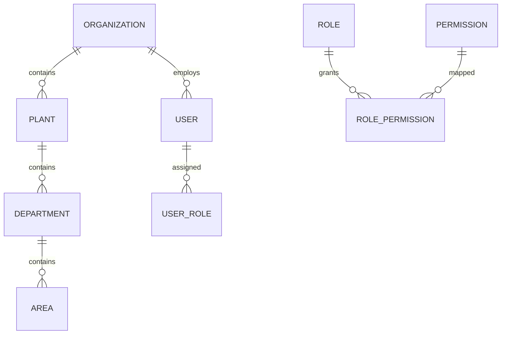

# Kenzo EHS — Database Design & Schema Specification

**System Database:** PostgreSQL 16 (Hosted on Neon AWS US-East-2 / Docker)  
**ORM:** Prisma 6.4.1  
**Total Entities (Phase 1):** 23 Tables  

---

## 1. Core Organizational Hierarchy

### Table Specifications

1. **`organizations`**
   - `id` (UUID, PK)
   - `name`, `code` (Unique)
   - `subscriptionTier`, `status`
   - `createdAt`, `updatedAt`

2. **`plants`**
   - `id` (UUID, PK), `organizationId` (FK)
   - `name`, `code` (Unique per org)
   - `locationCity`, `locationCountry`, `geoCoordinates` (JSONB)
   - `status`, `createdAt`, `updatedAt`

3. **`departments`**
   - `id` (UUID, PK), `organizationId` (FK), `plantId` (FK)
   - `name`, `code`
   - `status`, `createdAt`, `updatedAt`

4. **`areas`**
   - `id` (UUID, PK), `organizationId` (FK), `plantId` (FK), `departmentId` (FK)
   - `name`, `code`, `hazardClass`

---

## 2. Authentication, RBAC & Audit Tables

- **`users`**: Email, passwordHash, status, failedLogins, lockedUntil.
- **`sessions`**: Server-side session store with token hash, revoked flag, ipAddress, userAgent, expiresAt.
- **`roles`**: 19 operational roles (Admin, Corporate HSE, Plant Head, HSE Manager, Safety Officer, Area Manager, Worker, Auditor, etc.).
- **`permissions`**: 52 granular permissions (`MODULE.ACTION`).
- **`audit_logs`**: Immutable audit logs capturing beforeState/afterState diffs, actorId, plantId, requestId, ipAddress.
- **`outbox_events`**: Transactional outbox events for background worker dispatch.

---

## 3. Generic Workflow Tables

- **`workflow_definitions`**: Module-specific workflows (e.g. `HIRA_STUDY_STANDARD_V1`).
- **`workflow_instances`**: Tracks active state of business records.
- **`workflow_steps`**: Historical record of every executed transition.
- **`workflow_tasks`**: Actionable tasks assigned to roles/users visible in Unified Inbox.

---

## 4. HIRA Domain Entities

- **`hira_studies`**: Reference numbers (`HIRA-2026-PLANT-0001`), title, scope, status (`DRAFT`, `IN_PROGRESS`, `TEAM_REVIEW`, `APPROVAL_PENDING`, `APPROVED`, `ACTIVE`, `SUPERSEDED`), revision counter.
- **`hira_activities`**: Routine/non-routine operational activities.
- **`hira_hazards`**: Initial severity/likelihood, initial score, residual severity/likelihood, residual score, ALARP justification.
- **`hira_controls`**: Hierarchy of controls (`ELIMINATION`, `SUBSTITUTION`, `ENGINEERING`, `ADMINISTRATIVE`, `PPE`).
- **`hira_reviews`**: Cross-functional team member recommendations.
- **`hira_approvals`**: Formal plant leadership approvals and risk override records.
