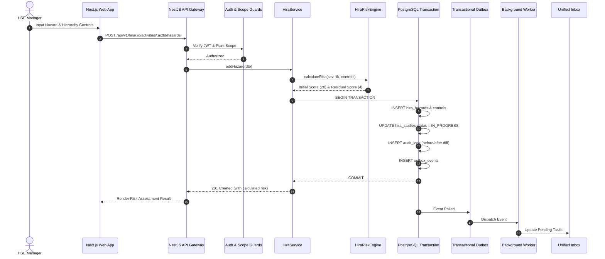

# Kenzo EHS — Data Flow & Transactional Pipeline

---

## 1. End-to-End Vertical Slice Mutation Pipeline

---

## 2. Server-Side Risk Math Flow

$$\text{Initial Risk Score} = \text{Severity} \times \text{Likelihood}$$

$$\text{Control Hierarchy Reduction} = \sum (\text{Hierarchy Weight} \times \text{Effectiveness \%} \times 0.40)$$

$$\text{Residual Likelihood} = \max(1, \text{round}(\text{Initial Likelihood} \times (1 - \text{Reduction})))$$

$$\text{Residual Risk Score} = \max(1, \text{Residual Severity} \times \text{Residual Likelihood})$$
