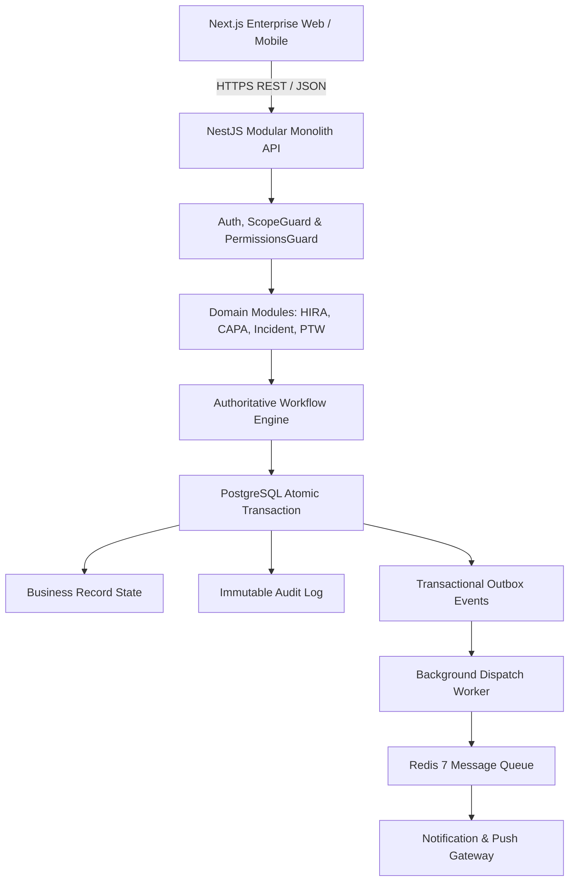

# Kenzo EHS — Enterprise System Architecture

**Document Version:** 1.0.0  
**Author:** Kenzo Infosystems Enterprise Architecture Team  
**System Status:** Phase 1 Operational Monolith

---

## 1. High-Level Architectural Vision

Kenzo EHS is architected as an authoritative **Modular Monolith** designed to scale from single-site operations to global multi-plant enterprise manufacturing complexes. The system enforces **strict single-source-of-truth semantics**, where PostgreSQL is the authoritative system of record and client devices are strictly presentation and submission conduits.

---

## 2. Architectural Principles

1. **PostgreSQL as Sole Authoritative Truth**:
   - Client state (`localStorage`, cookies) is strictly ephemeral and used only for session tokens.
   - All statuses, scores, review decisions, and counts are calculated server-side inside PostgreSQL transactions.

2. **Explicit Workflow Actions (No PATCH Shortcuts)**:
   - Entity status cannot be mutated arbitrarily (e.g. `PATCH /hira/:id { status: "APPROVED" }` is strictly disallowed).
   - All state transitions require explicit verb endpoints: `/actions/submit`, `/actions/review`, `/actions/approve`, `/actions/activate`.
   - Transitions validate actor scope, role permissions, active state, and business pre-conditions.

3. **Atomic Mutation Pattern**:
   Every state change must execute within an atomic transaction:
   $$\text{BEGIN TRANSACTION} \implies \text{Record Mutation} \implies \text{Workflow Transition} \implies \text{Audit Log} \implies \text{Outbox Event} \implies \text{COMMIT}$$

4. **Multi-Tenancy & Geographic Scope Isolation**:
   - Organization tenant separation is non-negotiable (`organizationId` on all tables).
   - 6 hierarchical access scopes: `SYSTEM`, `ORGANIZATION`, `ALL_PLANTS`, `OWN_PLANT`, `OWN_DEPARTMENT`, `OWN_RECORDS`.
   - Backend guards reject cross-tenant and out-of-scope requests before database execution.

---

## 3. Monorepo Structure

| Package / Application | Role                                     | Technology Stack                                 |
| :-------------------- | :--------------------------------------- | :----------------------------------------------- |
| `apps/api`            | Enterprise API & Engine                  | NestJS 11, Prisma ORM, Express, Helmet, Swagger  |
| `apps/web`            | Enterprise Web Portal                    | Next.js 15 (App Router), TailwindCSS, TypeScript |
| `apps/mobile`         | Mobile Field Application                 | React Native / Expo Architecture (Reserved)      |
| `packages/types`      | Enterprise Enums & Domain Interfaces     | TypeScript                                       |
| `packages/validation` | Shared Zod Schemas                       | Zod                                              |
| `packages/utils`      | Shared Utility Functions (Reference IDs) | TypeScript                                       |
| `packages/ui`         | Design Tokens & Badges                   | TailwindCSS, React                               |
| `packages/config`     | ESLint, Prettier, TypeScript Configs     | Base configurations                              |
