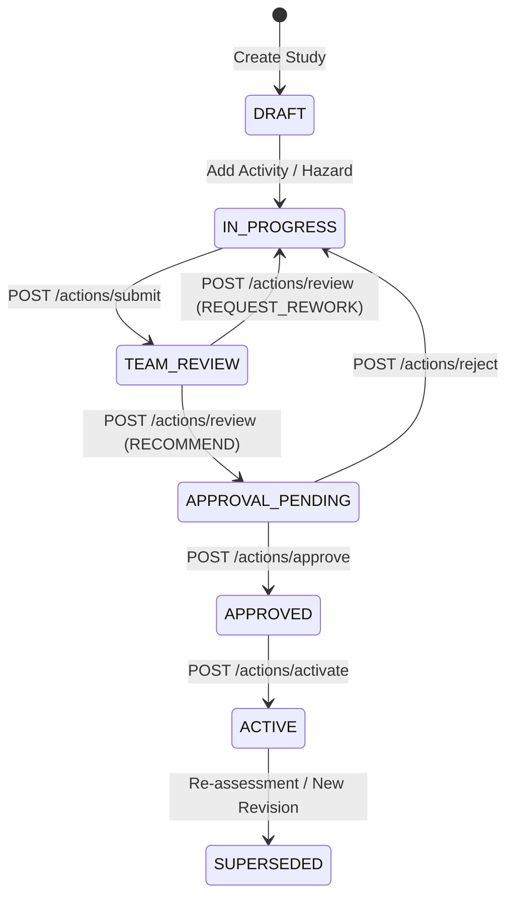

# Kenzo EHS — Authoritative Workflow Engine Specification

---

## 1. Principle of Explicit State Transitions

To ensure compliance with OSHA, ISO 45001, and statutory safety mandates, the Kenzo EHS platform forbids arbitrary `PATCH` requests on entity statuses.

Transitions must follow explicit lifecycle graphs enforced by the backend `WorkflowService`.

---

## 2. Transition Verification Pipeline

When a workflow transition endpoint is called:

1. **Active State Verification**: Confirms the entity's current state in PostgreSQL matches the expected origin state.
2. **Permission Check**: Verifies the actor has the specific action permission (e.g. `HIRA.APPROVE`).
3. **Scope Check**: Verifies the actor has plant-level or organizational authority over the target site.
4. **Pre-condition Validation**:
   - At least 1 hazard must exist before submission.
   - Any `CRITICAL` residual risk requires explicit override justification and the `HIRA.OVERRIDE_UNACCEPTABLE` permission.
5. **Atomic Execution**: Updates the record state, completes existing pending tasks, spawns next tasks, writes an immutable audit record, and registers an outbox event.
